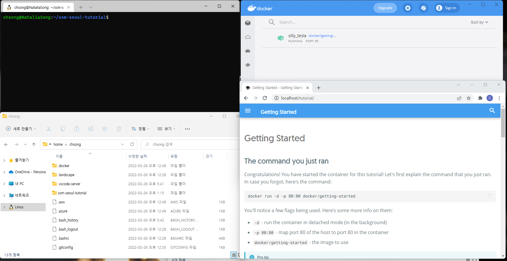
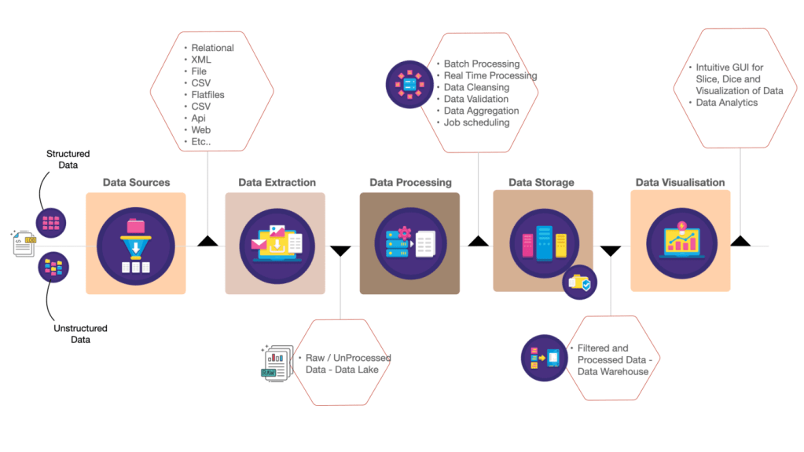

# Practical Issues in Data Engineering

## 내 환경설정
```
Windows 11
WSL2 (Ubuntu-20.04)
Docker Desktop 4.5.1
```



## Data Engineering
```
"데이터 공학"은 대규모 데이터를 효율적으로 관리 및 처리하고, 
이를 통해 분석에 적합한 형태나 데이터 과학자가 사용할 수 있는 형태로 만드는 것에 대한 
공학 분야라고 말할 수 있습니다.
특히 엔터프라이즈 환경에서의 “데이터 엔지니어링" 분야의 업무는 우리가 익히 알고 있는 
BI (Business Intelligence) 업무와 유사한 특징을 가지고 있습니다. 
다만, 과거의 전통적인 "관계형 데이터베이스 기반의 데이터 파이프라인 생성을 통한 
데이터 웨어하우스 구축"에서 분산 환경의 "다양한 오픈소스의 조합을 통해서 
데이터 ETL 작업과 파이프라인을 구성"하고 운영한다는 점이 다른점이라고 볼 수 있습니다.
```

